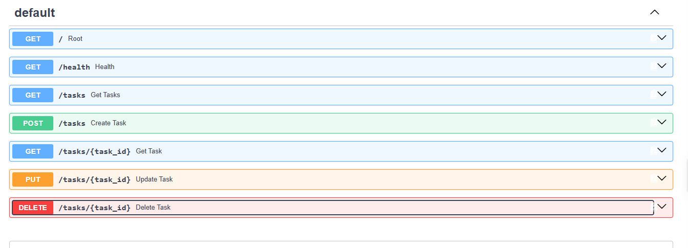
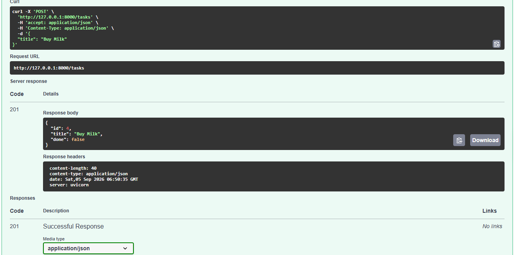

# Task API

A small CRUD API for managing a to-do list, built with FastAPI. Tasks are stored in memory (no database), so data resets whenever the server restarts.

## How to run

Requires Python 3.10+.

```bash
pip install fastapi uvicorn
uvicorn main:app --reload
```

The server starts on `http://localhost:8000`. Interactive docs (Swagger UI) are available at `http://localhost:8000/docs`.

## Endpoints

| Method | Path           | Description                     | Success | Error cases |
|--------|----------------|----------------------------------|---------|-------------|
| GET    | `/`            | API info                         | 200     | -           |
| GET    | `/health`      | Health check                     | 200     | -           |
| GET    | `/tasks`       | List all tasks                   | 200     | -           |
| GET    | `/tasks/{id}`  | Get one task                     | 200     | 404 if not found |
| POST   | `/tasks`       | Create a new task                | 201     | 400 if title missing/empty |
| PUT    | `/tasks/{id}`  | Update a task's title and/or done | 200    | 400 if title empty, 404 if not found |
| DELETE | `/tasks/{id}`  | Delete a task                    | 204     | 404 if not found |

## Example request

```bash
curl.exe -i http://localhost:8000/tasks/1                                      
```

```bash
HTTP/1.1 200 OK
date: Sat, 05 Sep 2026 07:05:58 GMT
server: uvicorn
content-length: 42
content-type: application/json

{"id":1,"title":"Do homework","done":true}
```

## Swagger UI

`/docs` lists every endpoint and lets you run the full CRUD cycle interactively via "Try it out."





## Design notes

- `done` is always `false` on creation; the client cannot set it via POST.
- PUT accepts partial updates — sending only `{"done": true}` will not clear an existing title. Both fields are optional; only fields actually present in the request body are applied.
- An empty or whitespace-only `title` is rejected with 400 on both POST and PUT.
- Data is in-memory only. Restarting the server clears all tasks.

## Adding Extras: filtering, search, stats, reset
Filtering and Search worked fine. Stats showed exactly how many tasks are added in the list, and how many are marked Done. Reset shows the original task list clearing the newly added tasks. Because these are not added in a database, so they only exist in the server memory. Reset falls back to the initial task list because the added tasks are not saved anywhere to retrive from.

## AI vs Me
<strong>Full Prompt</strong>: Build a to-do list using python and fastapi. have these endpoints, get tasks, create tasks, get tasks by id, update tasks, delete tasks. it should run in fastapi's swagger UI. I should be able to try it out. have these for each task, id[int], title[str], and done[bool]. for successful retrieval the status code return 200, for delete it return 201, for unknown id returns 400 and so on. give me the code so I can add as main.py and should be able to run with uvicorn.

<strong>Differences</strong>:
| AI | ME |
|----|----|
| Client has to supply id | Generated server-side id |
| Doesn't check if the title is an empty string | Checks for white space |
| Updates id, title, and done from the client side | Updates only the title finding the task by id |